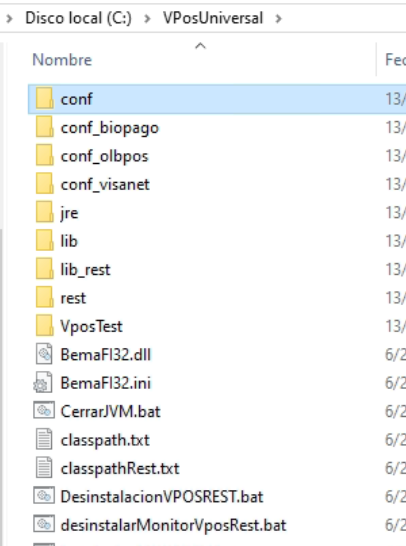
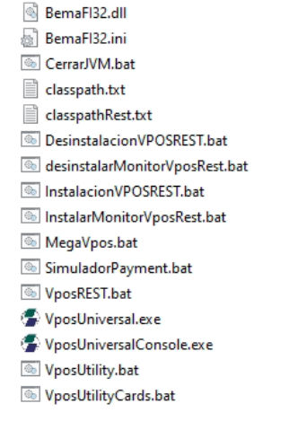
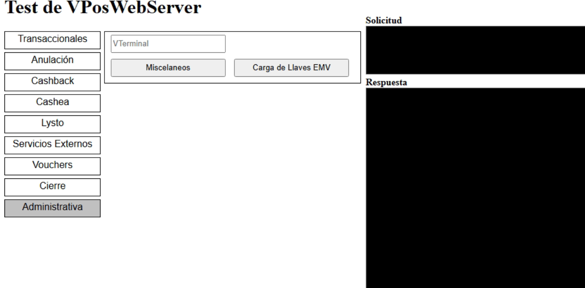
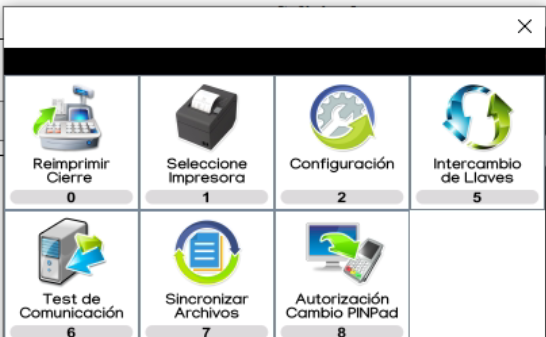
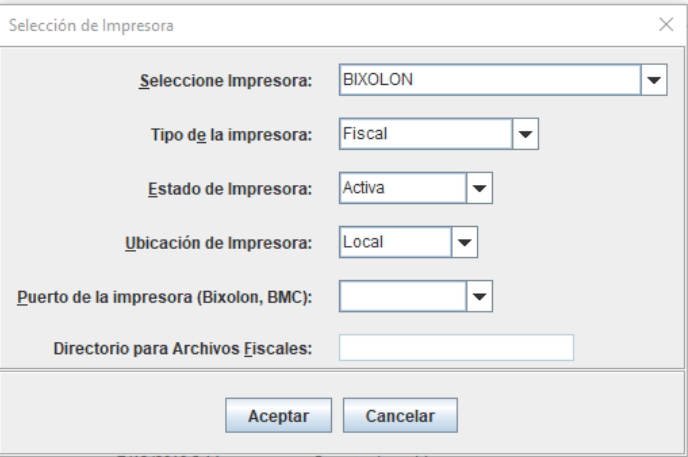
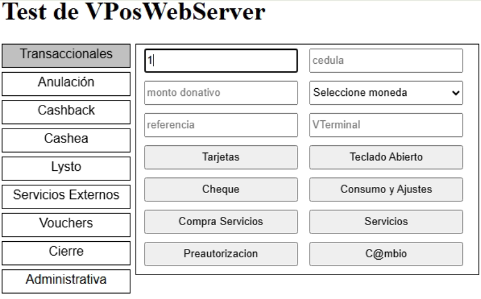

# Manual de Configuración e Instalación - Megasoft VPOS (VPosUniversal)

Este manual contiene las instrucciones detalladas para instalar, configurar y verificar el funcionamiento de la suite **Megasoft VPOS (VPosUniversal)**.

---

## Índice
1. [Introducción e Instalación](#1-introducción-e-instalación)
2. [Configuración de Archivos](#2-configuración-de-archivos)
   - [vposconf.ini](#21-configuración-de-vposconfini)
   - [vposuniversal.ini](#22-configuración-de-vposuniversalini)
   - [vposo2d.ini](#23-configuración-de-vposo2dini)
3. [Ejecución e Instalación del Servicio](#3-ejecución-e-instalación-del-servicio)
4. [Pruebas de Funcionamiento (Test VPosWebServer)](#4-pruebas-de-funcionamiento-test-vposwebserver)
   - [Prueba de Comunicación y Carga de Llaves](#41-prueba-de-comunicación-y-carga-de-llaves)
   - [Configuración de Impresora](#42-configuración-de-impresora)
   - [Pruebas Transaccionales](#43-pruebas-transaccionales)
5. [Administración del Servicio (Iniciar / Cerrar)](#5-administración-del-servicio-iniciar--cerrar)

---

## 1. Introducción e Instalación

Para iniciar el proceso de instalación, siga estos pasos:

1. **Descomprimir la última versión** del paquete comprimido de VPOS.
   
   Ejemplo de archivo comprimido:
   

2. **Renombrar la carpeta** descomprimida a `VPosUniversal` para facilitar la gestión.
3. **Mover la carpeta** al directorio raíz del disco local `C:\` (quedando como `C:\VPosUniversal`).

   

> [!NOTE]
> Todos los archivos de configuración mencionados a continuación se encuentran en la ruta `C:\VPosUniversal\conf\`. En su espacio de trabajo actual, puede acceder y modificar directamente las plantillas correspondientes en los siguientes enlaces:
> - [vposconf.ini](./vposconf.ini)
> - [vposuniversal.ini](./vposuniversal.ini)
> - [vposo2d.ini](./vposo2d.ini)

---

## 2. Configuración de Archivos

### 2.1 Configuración de [vposconf.ini](./vposconf.ini)

Modifique las siguientes secciones según las directrices:

#### Servidor y Comunicación
Establezca el host de producción y puerto correspondientes:
```ini
[server]
host=ssl.megasoftve.com
port=4763
```

#### Identificador de Terminal (VTID)
Indique el código único (`vtid`) y número identificador de la caja (ejemplo: `01`):
```ini
[vtid]
vtid=vit de la caja
id=numero de la caja ejemplo 01
```

#### Pinpad
Verifique el puerto serie COM de conexión física del dispositivo:
```ini
[pinpad]
puerto=COM9
```

#### Configuración para Contactless (Pinpad Verifone)
Configure los parámetros de contacto de aproximación si se utiliza un modelo Verifone Engage:
```ini
[pinpad-verifone]
modelo=ENGAGE
puerto=USB
comandosNuevos=1
tipoPinblock=DUKPT
dataSensibleEncriptada=1
```

#### Configuración del Voucher (Recibo)
Configure el encabezado y obligue al sistema a imprimir únicamente **una sola copia** (`copias=1`):
```ini
[voucher]
tienda=Configurar Caja
localidad=
rif=
copias=1
encabezado=
LineaEncabezado4= RIF: J-********-*
LineaEncabezado7= Telf: 0212-000-0000
LineaEncabezado8= *** NO FISCAL ***
LineaEncabezado9= REPORTE NRO:
```

---

### 2.2 Configuración de [vposuniversal.ini](./vposuniversal.ini)

#### Cierre de Voucher
Configure los parámetros del precierre e indique al sistema que **no imprima el detallado de transacciones** fijando `imprimirTransacciones=0`:
```ini
[cierrevoucher]
detalle=1
encabezado1=1
encabezado2=1
archivo=1
saltolinea=1
transaccionigualcero=0
consolidado=1
totalMarca=0
imprimetotalesbanco=1
imprimeLealtadDebito=0
imprimeLealtadCredito=0
reporteDetalladoMesero=0
resumen=0
literalEncabezado=0
imprimirTransacciones=0
imprimirDetalleExtracredito=1
maxCaracterImpresion=32
alineacionTexto=L
```

#### Transacciones Permitidas
Active o desactive los distintos métodos transaccionales del terminal estableciendo `1` para activo y `0` para inactivo:
```ini
[transaccionespermitidas]
tipo0=Tarjeta
activo0=1
imagen0=./conf/Imagenes/ComprasOfc.jpg
tecla0=0
titulo0=Tarjeta

tipo1=Cambio
activo1=0
imagen1=./conf/Imagenes/Cambio.jpg
tecla1=V
titulo1=Cambio

tipo17=OtrosMedios
activo17=0
imagen17=./conf/Imagenes/OtrosMedios.jpg
tecla17=M
titulo17=Pago Otros Medios
```

#### Compra y Medios de Pago
Configure cuáles opciones visuales aparecerán en pantalla al procesar cobros:
```ini
[COMPRA_MEDIOS_PAGO]
activo=0
nroproducto=15
*-----------
tipo0=MedioPagoTarjeta
activo0=1
imagen0=./conf/Imagenes/MedioPagoTarjeta.jpg
tecla0=0
titulo0=Medio Pago Tarjeta

tipo2=MedioPagoC2P
activo2=0
imagen2=./conf/Imagenes/PagoMovil.jpg
tecla2=2
titulo2=Medio Pago C2P
*-----------
tipo3=MedioPagoP2C
activo3=0
imagen3=./conf/Imagenes/PagoMovilP2C.jpg
tecla3=3
titulo3=Medio Pago P2C
```

---

### 2.3 Configuración de [vposo2d.ini](./vposo2d.ini)

#### Pago Móvil (C2P/P2C)
Configure el código de banco, número de teléfono asociado y nombre de la entidad según el formato especificado en la plantilla:
```ini
[acqcodeTlfp2c]
cant=1
cantVisible=5
acqcodeTlfp2c1=0115#04145230572,Exterior - 0414-5230572
```

---

## 3. Ejecución e Instalación del Servicio

> [!WARNING]
> Se recomienda encarecidamente ejecutar las instalaciones y el monitor con privilegios de **Administrador**.

Para inicializar el servicio de VPOS en el equipo local, ejecute por orden los siguientes scripts por lotes (`.bat`) ubicados en la raíz de `C:\VPosUniversal\`:

1. **`InstalacionVPOSREST.bat`**: Registra e instala la arquitectura REST de VPOS en el sistema operativo.
2. **`InstalarMonitorVposRest.bat`**: Añade el monitor que vigila constantemente el estado del puerto e hilos.



---

## 4. Pruebas de Funcionamiento (Test VPosWebServer)

Una vez iniciado el servicio de comunicación, abra el navegador web y navegue a la interfaz de prueba local provista en el paquete:

`C:\VPosUniversal\rest\html\TestVPosREST.html`



### 4.1 Prueba de Comunicación y Carga de Llaves
1. Seleccione la pestaña **Administrativa** en la barra lateral izquierda.
2. Haga clic en **Misceláneos**.
3. Presione el botón **Test de Comunicación** (Identificado con el número `6`).
4. Si la comunicación es satisfactoria y se va a usar un pinpad físico, presione el botón **Intercambio de Llaves** (Identificado con el número `5`).



---

### 4.2 Configuración de Impresora
Para impresoras de tipo **HKA** u homologadas:
1. En el menú **Administrativa** -> **Misceláneos**, presione **Seleccione Impresora** (Identificado con el número `1`).
2. Indique el driver de la impresora (por ejemplo, `BIXOLON`), fije el tipo en `Fiscal`, y el estado en `Activa`.
3. Valide que imprima de manera correcta generando un voucher de prueba o precierre.



---

### 4.3 Pruebas Transaccionales
Para comprobar que los medios de cobro configurados estén plenamente funcionales:
1. Diríjase a la sección **Transaccionales** de la barra lateral.
2. Digite un importe representativo (por ejemplo, `1.`).
3. Presione el botón **Tarjetas** (o el medio correspondiente). 
4. Si únicamente se ha activado el *Pago Móvil*, en la interfaz emergente solo deberá presentarse dicha alternativa.



---

## 5. Administración del Servicio (Iniciar / Cerrar)

* **Detener el servicio**: Ejecute el script `CerrarJVM.bat` para apagar la máquina virtual de Java que soporta el servidor Megasoft.
* **Iniciar el servicio**: Ejecute el script `VposREST.bat`. El sistema tardará unos segundos en inicializar la comunicación. *(No requiere ejecutarse como administrador)*.

> [!TIP]
> Se recomienda realizar un reinicio del equipo de prueba para comprobar que el servicio Megasoft cargue de forma automática y transparente sin presentar advertencias o diálogos flotantes al usuario.
